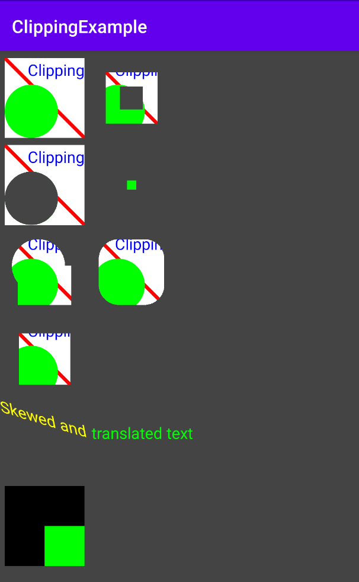

# ClippingExample

Clipping Canvas Objects  
Lesson 5 of [Advanced Android with Kotlin course on Udacity](https://classroom.udacity.com/courses/ud940)

## Introduction

Demonstrates how setting different clipping paths affects the drawing of rectangles, lines, text, and circles.

This app draws seven squares that each demonstrates a clipping region, or combination of several clipping regions, including a picture frame, circular clipping, and using a DIFFERENCE and INTERSECT operator when combining clipping regions.

The app also demonstrates how to draw transformed text on a canvas, using translation and skewing.

Tasks:

* Shapes setup
* Understanding the drawing algorithm
* Create a method to draw the shapes
* Implement the clipping methods
* Use quickReject()

## Screenshots

